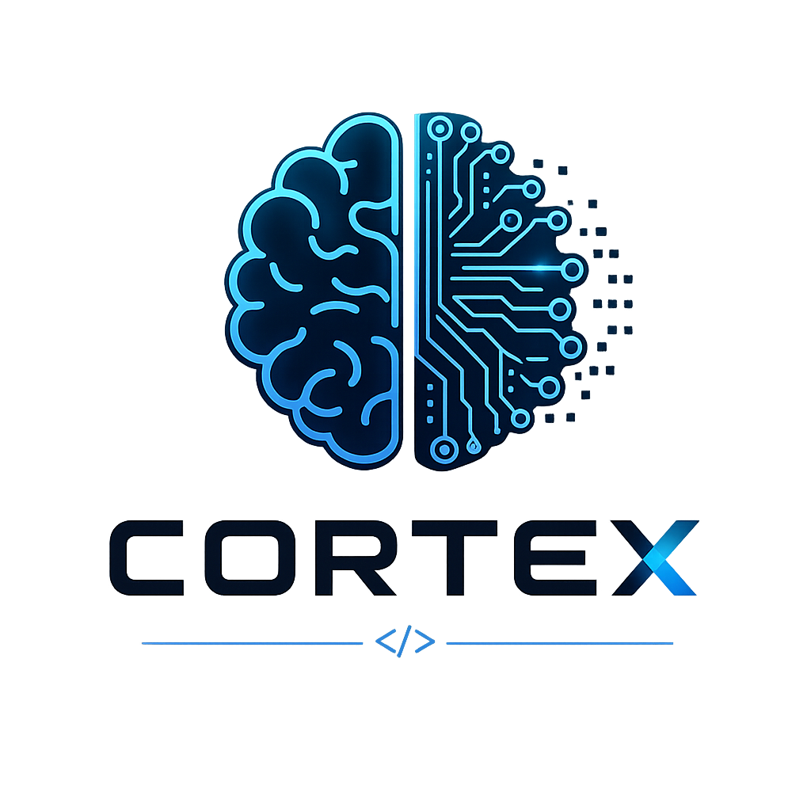

<p align="center">
  
</p>

<h1 align="center">FinancialFriend — Gestão Financeira</h1>

<p align="center">
  <strong>Controle financeiro pessoal para Gabriel & Carol</strong>
</p>

<p align="center">
  
</p>

<p align="center">
  Contas mensais · Investimentos · Metas · Receitas · FGTS · Patrimônio Líquido
</p>

<p align="center">
  
  
  
  
</p>

---

> [!NOTE]
> **Sobre este projeto** — Nasceu da necessidade pessoal de um sistema robusto de gestão financeira, e do interesse em explorar desenvolvimento fortemente assistido por IA. Ao longo do desenvolvimento, atuei como **coordenador e revisor** — definindo requisitos, validando entregas e tomando decisões arquiteturais. O resultado é um estudo de caso real de desenvolvimento assistido por IA (Claude, Anthropic).

---

## Visão Geral

**FinancialFriend** é uma aplicação web para controle financeiro pessoal e compartilhado. Permite que duas pessoas gerenciem juntas contas, investimentos, metas e receitas a partir de qualquer dispositivo.

O repositório também contém o **GFGC** (legado) — a versão desktop Electron que antecedeu o FinancialFriend. Ambas coexistem no mesmo repositório durante a migração.

| | GFGC (legado) | FinancialFriend (atual) |
|---|---|---|
| **Tipo** | App desktop (Electron) | App web (Next.js) |
| **Dados** | JSON local | Supabase (PostgreSQL) |
| **Acesso** | Um dispositivo | Qualquer dispositivo |
| **Usuários** | Um | Multi-usuário (household) |
| **Status** | Produção (legado) | Desenvolvimento ativo |
| **Pasta** | `src/` | `cortex/` |

---

## Funcionalidades

### Contas Mensais
- Templates recorrentes com geração automática por mês
- Status: pendente, pago, atrasado (calculado por data)
- Edição inline + toggle de status com um clique
- Suporte a múltiplos workspaces (ex.: contas pessoais + contas do casal)

### Investimentos
- Tipos: Renda Fixa, Ações, Fundos, Criptomoedas, Outro
- Transações: aportes, resgates, rendimentos
- Saldo calculado automaticamente pelo histórico
- Edição inline do investimento e suas transações

### Metas Financeiras
- Metas manuais com registro de contribuições por período
- Periodicidade: mensal, trimestral, semestral, anual, custom
- Barra de progresso com status acima/abaixo/na meta
- Histórico de contribuições expandível por meta

### Receitas
- Categorias: Salário, Freelance, Rendimentos, Bônus, Outros
- Receitas recorrentes com geração automática
- Navegação por mês com edição inline

### FGTS
- Registro mensal de saldo por workspace
- Integrado ao cálculo de patrimônio líquido

### Dashboard
- Resumo mensal: receitas, despesas, saldo, patrimônio
- Lista de contas pendentes e status de pagamento
- Navegação entre meses

### Patrimônio Líquido
- Consolidado: investimentos ativos + saldo FGTS
- Agrupamento por tabs configuráveis

### Configurações
- Workspaces CRUD (contas, investimentos, FGTS, receitas)
- Categorias CRUD com cores
- Gestão de membros do household (convite por código)
- Reset total com confirmação por frase

---

## Arquitetura

```
Browser ──→ Next.js 16 App Router (Vercel)
                │
                ├── proxy.ts (auth guard via Supabase SSR)
                │
                ├── app/(auth)/          ← login, register
                ├── app/(app)/           ← seções protegidas
                │   ├── layout.tsx       ← sidebar + providers
                │   ├── dashboard/
                │   ├── bills/
                │   ├── investments/
                │   ├── fgts/
                │   ├── goals/
                │   ├── income/
                │   ├── networth/
                │   ├── settings/
                │   └── onboarding/
                ├── app/auth/callback/   ← email confirmation handler
                └── app/api/reset/       ← reset total (service_role)

                Supabase (PostgreSQL)
                ├── RLS em todas as tabelas (default deny)
                ├── Household model → dados isolados por grupo
                ├── Storage bucket → attachments
                └── Auth → email/password + confirmação

Client state: TanStack Query v5 + Zustand (UI only)
```

---

## Stack

| Camada | Tecnologia |
|--------|-----------|
| Framework | Next.js 16, React 19 |
| Linguagem | TypeScript 5 |
| Estilo | Tailwind CSS v4 |
| Backend | Supabase (PostgreSQL + Auth + Storage) |
| Data fetching | TanStack Query v5 |
| Estado UI | Zustand v5 |
| Ícones | Lucide React |
| Deploy | Vercel |

---

## Começando (desenvolvimento local)

### Pré-requisitos

- Node.js >= 18
- Conta no [Supabase](https://supabase.com) com projeto criado
- Supabase CLI instalado (`brew install supabase/tap/supabase`)

### Setup

```bash
git clone https://github.com/gluizcortez/gfgc.git
cd gfgc/cortex

# Instalar dependências
npm install

# Configurar variáveis de ambiente
cp .env.local.example .env.local
# Edite .env.local com suas credenciais Supabase

# Aplicar migrations no projeto Supabase
supabase link --project-ref <seu-project-ref>
supabase db push

# Iniciar o servidor de desenvolvimento
npm run dev
```

Acesse [http://localhost:3000](http://localhost:3000).

### Variáveis de ambiente

```env
NEXT_PUBLIC_SUPABASE_URL=https://<ref>.supabase.co
NEXT_PUBLIC_SUPABASE_PUBLISHABLE_KEY=sb_publishable_...
SUPABASE_SERVICE_ROLE_KEY=eyJ...   # nunca expor no cliente
```

O `SUPABASE_SERVICE_ROLE_KEY` é usado apenas na rota `/api/reset` (server-side).

### Configurações no Supabase Dashboard

Em **Authentication → URL Configuration**, adicione às URLs de redirecionamento permitidas:
- `http://localhost:3000/auth/callback` (desenvolvimento)
- `https://seu-dominio.vercel.app/auth/callback` (produção)

---

## Estrutura de pastas (cortex/)

```
cortex/
├── app/
│   ├── (auth)/           ← login, register
│   ├── (app)/            ← seções protegidas com sidebar
│   ├── auth/callback/    ← handler de email confirmation
│   └── api/reset/        ← reset total (service_role, server only)
├── components/
│   ├── bills/
│   ├── investments/
│   ├── goals/
│   ├── fgts/
│   ├── income/
│   ├── networth/
│   ├── dashboard/
│   ├── settings/
│   ├── onboarding/
│   ├── layout/
│   └── shared/
├── lib/
│   ├── supabase/
│   │   ├── client.ts           ← browser client
│   │   ├── server.ts           ← server client + service client
│   │   └── queries/            ← CRUD por domínio (9 arquivos)
│   ├── calculations.ts         ← lógica financeira pura
│   ├── formatters.ts
│   ├── billStatus.ts
│   └── constants.ts
├── stores/
│   └── useUIStore.ts           ← apenas estado de UI
├── types/
│   ├── models.ts               ← tipos de domínio
│   └── database.ts             ← gerado pelo Supabase CLI
├── supabase/
│   └── migrations/             ← 4 migrations SQL
└── proxy.ts                    ← auth guard (Next.js middleware)
```

---

## Schema do banco

Todas as tabelas têm RLS habilitada com política default-deny. Acesso limitado a membros do mesmo `household`.

Tabelas principais: `profiles`, `households`, `household_members`, `workspaces`, `categories`, `custom_fields`, `bills`, `monthly_bill_records`, `bill_entries`, `investments`, `investment_transactions`, `fgts_records`, `goals`, `goal_contributions`, `income_entries`, `attachments`, `release_notes`.

Valores monetários: armazenados em **centavos** (`bigint`).

---

## GFGC (legado)

O app desktop Electron original ainda funciona e está na raiz do repositório (`src/`). Para rodá-lo:

```bash
# Na raiz do repositório
npm install
npm run dev        # abre a janela Electron
npm run build:mac  # gera .dmg para macOS
```

---

## Licença

Projeto pessoal. Todos os direitos reservados.

---

<p align="center">
  <br>
  <sub>FinancialFriend é um produto da <strong>Cortex</strong>.<br>Desenvolvido com coordenação humana e assistência de IA (Claude, Anthropic).</sub>
</p>